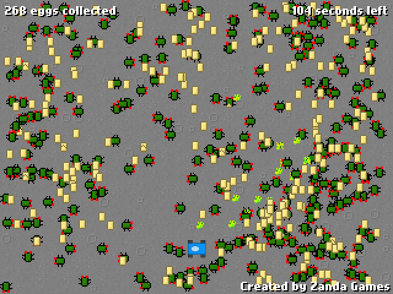

Alien Egg Farm
==============

Eggs are a great source of energy. Just think about Rocky. And what is the ultimate source of energy? Alien eggs!

In this game you are set on a planet trying to collect as many alien eggs as possible in 3 minutes. The trick is to let the aliens lay eggs, hatch and lay more eggs for a while, to maximize the number of eggs collected. But be careful to kill all the aliens before time is up, otherwise you will lose.

Alien Egg Farm was created by [Andras Nemeth](https://github.com/cu2) in 2011 in 48 hours for the [Reddit Game Jam 06](https://www.reddit.com/r/RedditGameJam/comments/gcp1v/reddit_game_jam_06_final_submissions_thread/?sort=top) (theme: ENERGY).

Also available on [Kongregate](https://www.kongregate.com/games/zandagames/alien-egg-farm).

Music by [Nevit Dilmen](http://commons.wikimedia.org/wiki/File:Blip-blop-02-nevit.ogg)

Dependencies for compilation:
* [Flex 3.4.1](http://opensource.adobe.com/wiki/display/flexsdk/Flex+SDK) (probably works with other Flex v3 subversions)
* [Flixel 2.35](http://flixel.org/) (probably works with other Flixel v2 subversions)

Review from the [Reddit thread](https://www.reddit.com/r/RedditGameJam/comments/gcp1v/reddit_game_jam_06_final_submissions_thread/c1mlqis/):

> I LOVE this one. Everything about it is awesome. Except the really weak link to energy :p
> Graphics, awesome. Consistent theme, great style, and well done! Music and sound effects, brilliant. They fit in with the graphics & style so perfectly Concept / Gameplay: Awesome concept, and well executed! Except for the really weak link to energy of course :p It's a great concept though, and makes for awesome gameplay! Really well put together, and is great fun to play :) 3 mins is a little too long though, I think :p Managed to gather 1200+ eggs, but couldn't kill the aliens, they were out of control, so I lost :) I love this so much, awesome work!
